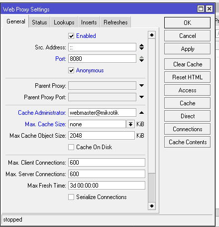
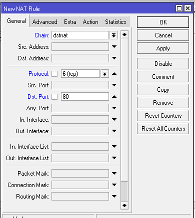
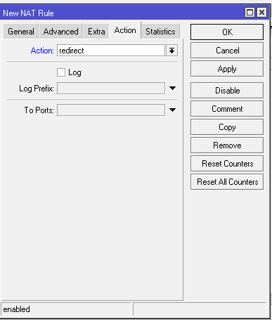
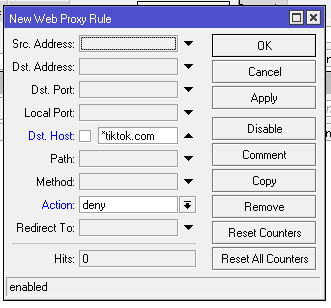
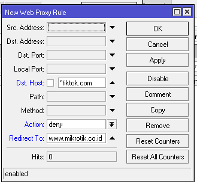

# LAB-34-WEB-PROXY
tanggal 20 agustus 2025

# web proxy
Apa itu Web Proxy? Web proxy adalah suatu sistem atau teknologi perantara yang menghubungkan perangkat pengguna ke internet sambil menyembunyikan identitas asli pengguna. Dengan menggunakan alamat IP dari server proxy, data yang dikirimkan akan tampak berasal dari proxy tersebut, sehingga privasi dan keamanan data pribadi pengguna lebih terjaga.

# konfigurasi web proxy
Contoh, kita akan memblokir akses internet dari client ke www.tiktok.com. utamakan sudah melakukan konfigurasi dasar sampai terhubung ke iternet

1. Aktifkan web-proxy
   Pertama, aktifkan terlebih dulu service dari web-proxy pada MikroTik dengan pengaturan pad menu IP -> Web Proxy.
  Centang pilihan Enable, dan tentukan pada port berapa proxy bekerja. By default web-proxy akan bekerja pada port 8080.
  Salah satu keunggulan Web Proxy adalah kemampuannya menyimpan (cache) file yang sering diakses, sehingga akses berikutnya akan lebih cepat. Untuk mengatur cache:

  Sampai langkah ini, web-proxy pada Router Mikrotik sudah aktif sebagai Regular HTTP Proxy. Dengan kata lain jika PC Client ingin menggunakan service proxy ini, maka harus      disetting secara manual pada web browser masing-masing client dengan menunjuk ip-mikrotik port 8080.

  Agar tidak perlu setting web-browser client satu per satu, ubah web-proxy Mikrotik agar berfungsi sebagai **Transparent Proxy**. Implementasinya, gunakan fitur NAT untuk       membelokan semua traffic browsing HTTP (tcp 80) yang berasal dari client ke fitur internal web-proxy yang sudah diaktifkan sebelumnya.

  Untuk membuatnya masuk pada menu IP->Firewall->NAT->Klik + 

  Selanjutnya, karena semua traffic HTTP dari client sudah masuk ke web-proxy, maka bisa dilakukan manajemen. Salah satunya adalah melakukan blocking akses client ke             website tertentu.

2. Block Website
   Untuk melakukan block akses client ke website tertentu dapat dilakukan pada menu ip > Webproxy -> Access
   Tambahkan rule web-proxy access baru. Dalam contoh ini, client tidak diperbolehkan akses ke www.tiktok.com

   Definisikan website yang akan diblock pada parameter dst-host dengan action=deny.

   Jika  diperhatikan, penulisan dst-host tidak menggunakan alamat website lengkap akan tetapi menggunakan tanda bintang (*) di depan dan belakang nama/alamat website. Tanda *    dimaksudkan sebagai wildcard untuk menggantikan semua karakter. Dengan ditambahkan wildcard, traffic client yang menuju ke website yang URL-nya terdapat kata "tiktok" akan     diblock.
   
3. Block & Redirect Website
   Kita juga bisa memodifikasi rule-nya dengan me-redirect ke situs lain. Misalnya ketika ada Client yang mengakses www.tiktok.com maka akan langsung dialihkan (redirect) ke      www.mikrotik.co.id

# kesimpulan 
Proxy ini dapat digunakan untuk menyembunyikan alamat IP pengguna, mempercepat akses dengan caching, membatasi akses ke situs tertentu, serta mendeteksi dan memblokir konten berbahaya.
# sumber
https://citraweb.com/artikel/123/
